# 🚲 Bike Rental System — Kashmir  
A Java Swing desktop application for managing bike rentals locally in an offline environment.  
Designed with a clean UI, custom graphics, Kashmir-themed visuals, and full CRUD operations for bikes, customers, and rentals.

---

##  Features
###  Customer Management
- Add/register customers
- Age & license validation  
- Auto-generated customer IDs

###  Bike Inventory
- View all bikes  
- Add preloaded bikes (Royal Enfield, Pulsar, Apache)
- Status updates: Available / Rented

###  Rental System
- Rent bike to a customer  
- Calculate cost automatically  
- Store rental history  
- Save start date, return date, and total bill

### Return System
- Damage level selection  
- Auto damage fee calculation  
- Update bike availability  
- Auto-save on each operation

###  Data Persistence
All data is saved in local text files:
bikes.txt
customers.txt
rentals.txt

Nothing is lost when the app closes.

---

## 🖼 UI Highlights  
- Kashmir-themed mountain banner  
- Shawl-style paisley watermark background  
- Rounded modern buttons  
- Custom bike icon  
- Lightweight + offline

---

---

## ▶ How to Run (macOS / Windows / Linux)

### **1. Compile**
Open Terminal inside the project folder and run:

-javac BikeRentalSystem.java
-2. Run
-java BikeRentalSystem

-The Swing UI window will open.
---
## 📸 Application Screenshots

Below are screenshots showcasing different parts of the Kashmir Bike Rental System UI.

### 🏠 Dashboard
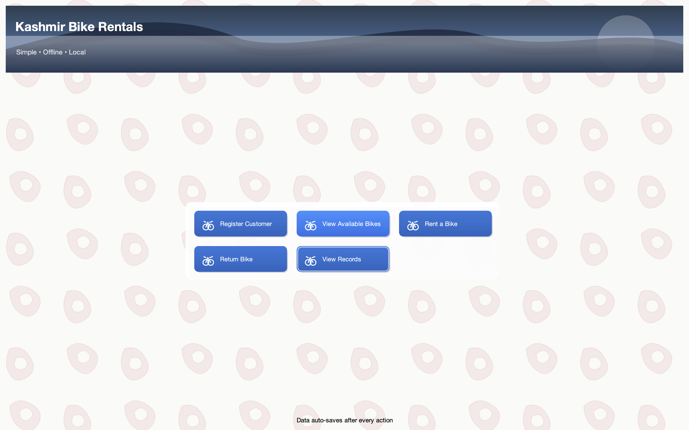

### 🚲 Available Bikes
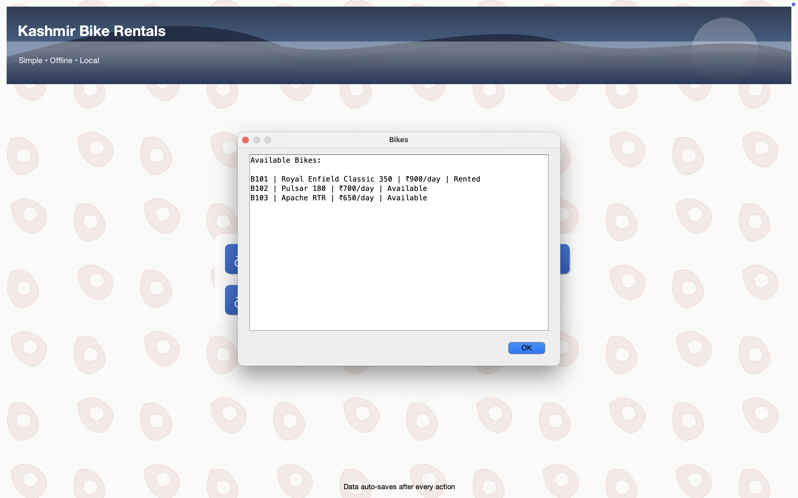

### 🧍 Register Customer
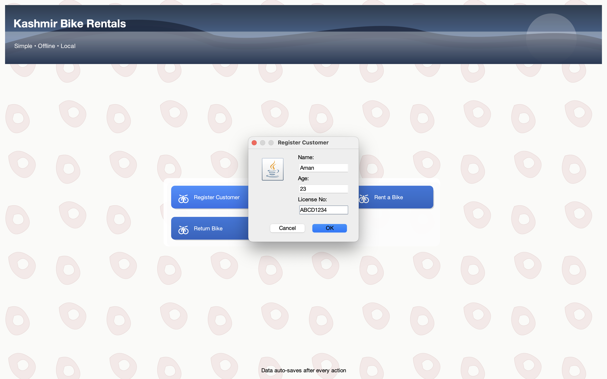
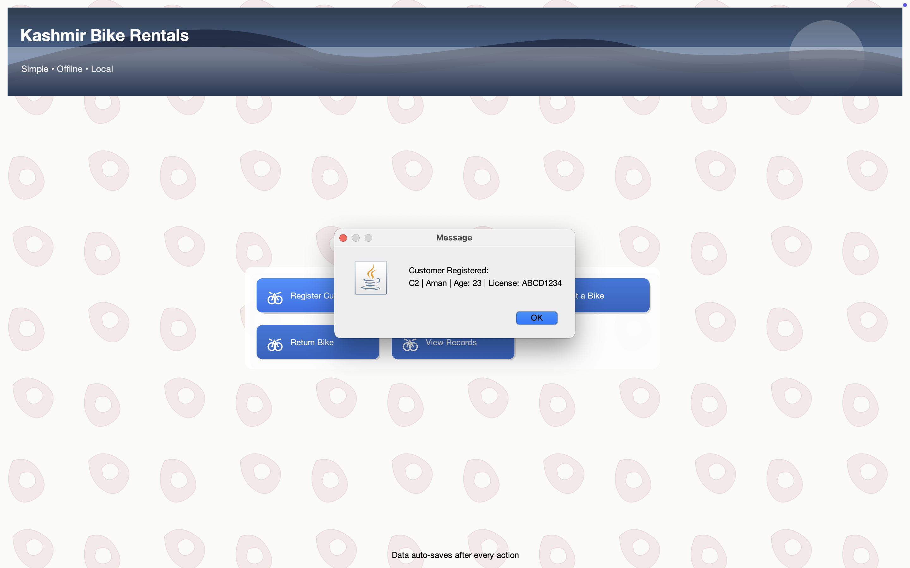

### 📝 Rental Process
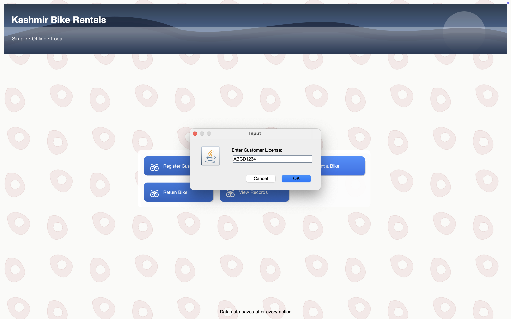

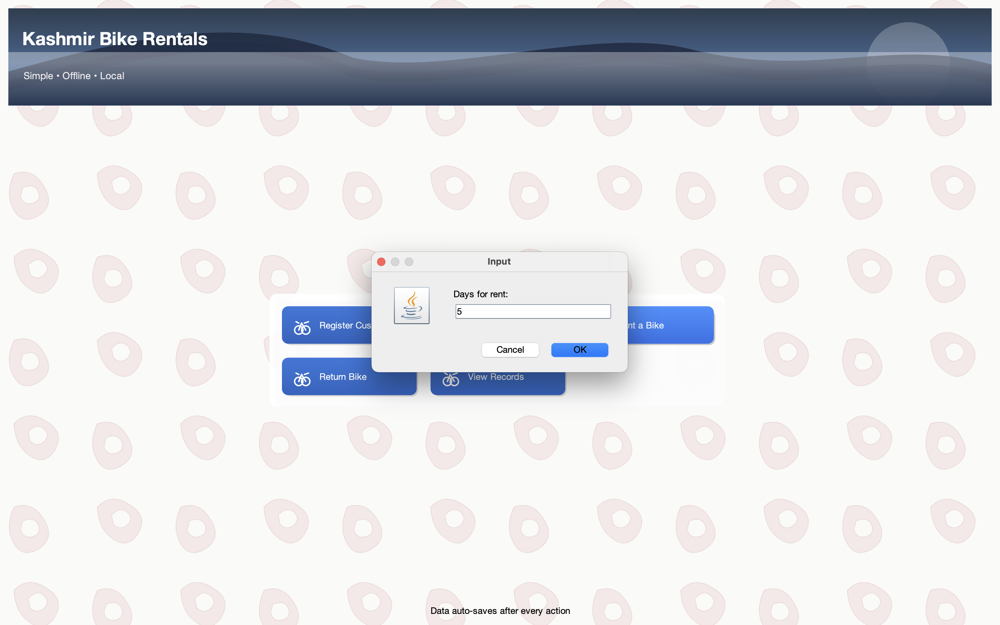
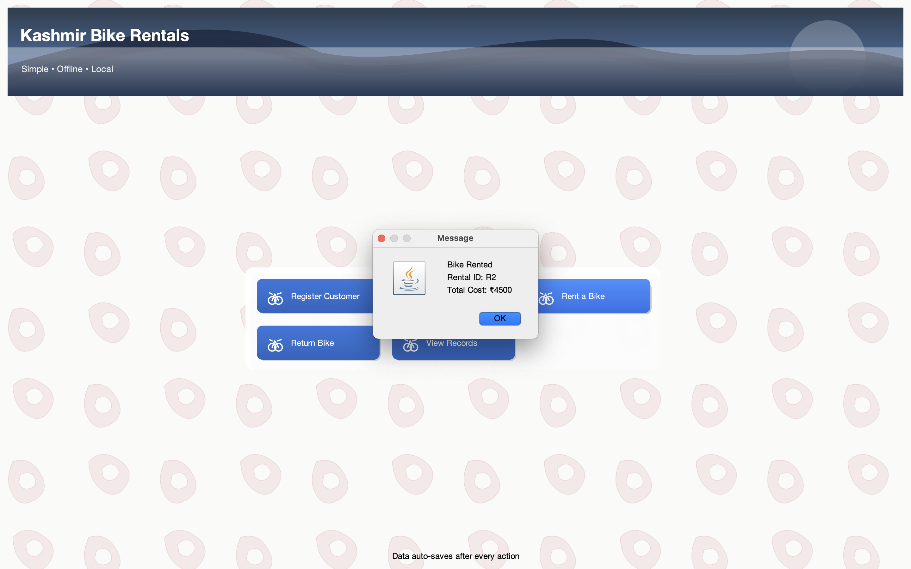

### 🔄 Return Process
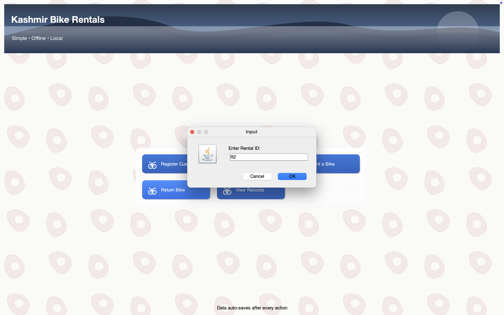
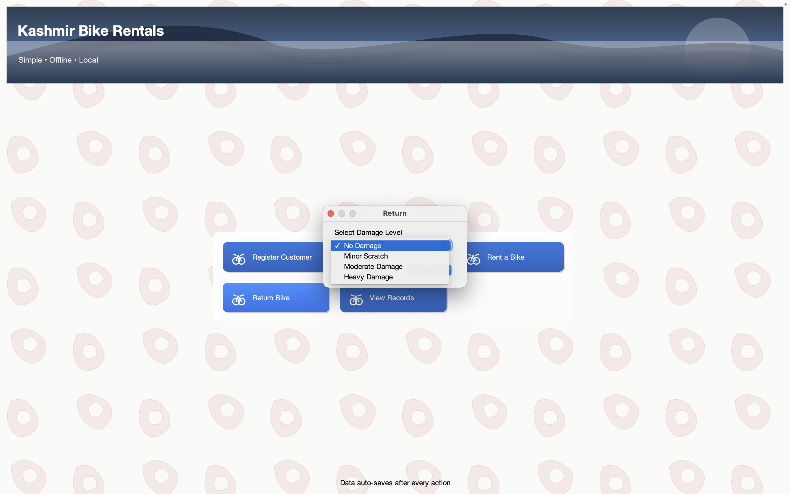
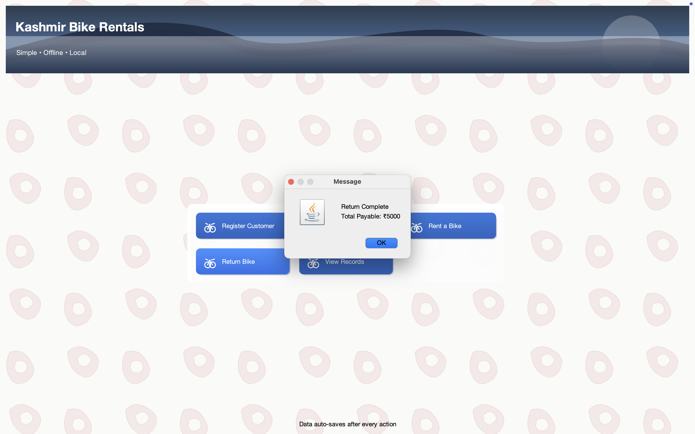

### 📚 Rental Records
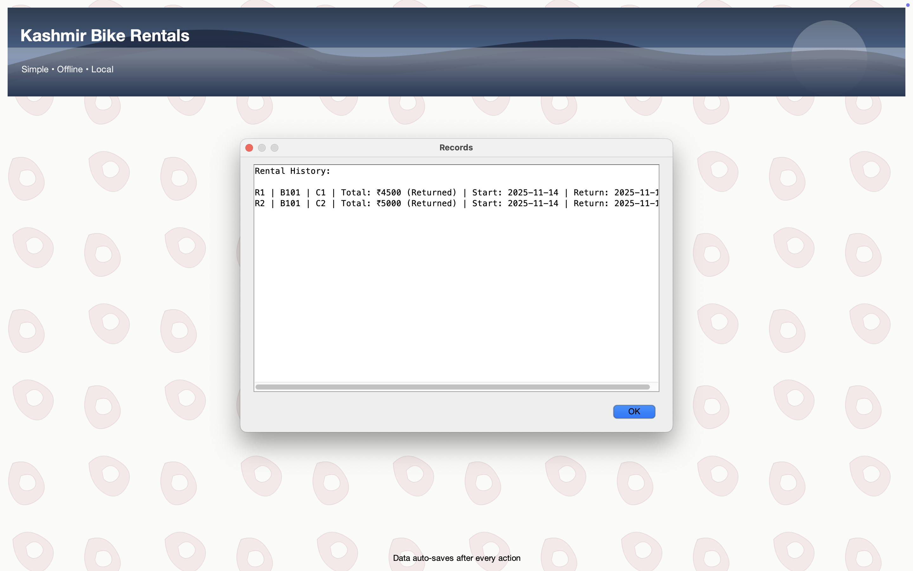
---
## Requirements

Java 8+ (recommended: Java 11 or 17)

Works on macOS, Windows, Linux

No external libraries required
---

